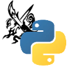

  
  
  

    B/E code for LOA Profile, powered by FastAPI
  

  

    
    
    
    
  

<!-- Content -->

 

### ❌ This repository is deprecated.

| Date       | Description            |
| ---------- | ---------------------- |
| 2022-10-08 | Deployed API prototype |
| 2023-12-07 | Final update           |
| 2024-11-03 | Archived               |

### Comments

> [!NOTE]  
> This article is written in Korean because this app was targeted at Korean LOST ARK players.

[로스트아크]를 플레이하는 유저들을 위한 홈페이지와 윈도우 프로그램, API 서버를 개발했었지만,  
제가 더 이상 게임을 플레이하지 않고, 다른 좋은 사이트도 많기 때문에 서비스를 중단하였습니다.  
24.11월 기준, 시즌4 업데이트로 인해 캐릭터 조회 API는 작동하지 않습니다.

데이터는 [로스트아크 오픈 API]를 사용하였습니다.

[로스트아크]: https://lostark.game.onstove.com/Main
[로스트아크 오픈 API]: https://developer-lostark.game.onstove.com/
